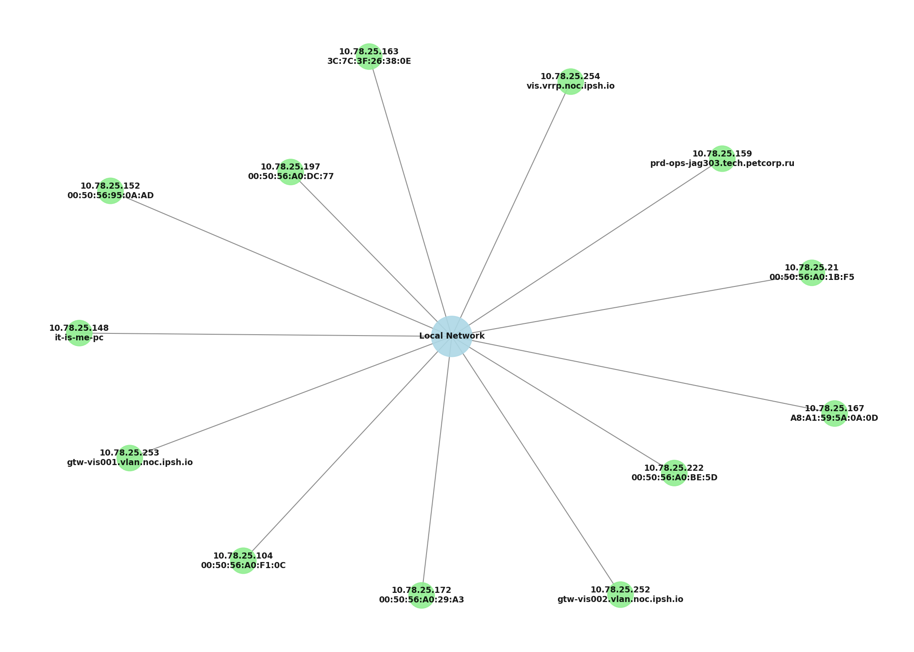

# Network Topology Visualizer

Скрипт для автоматического сканирования локальной сети и создания визуальной топологии (графа) устройств с помощью `nmap` и Python.

Идеально подходит для системных администраторов и энтузиастов, кто хочет быстро получить наглядную карту своей сети.

 *(пример после запуска)*

---

## Как это работает

1. Bash-скрипт принимает CIDR-подсеть (например, `192.168.1.0/24`)
2. Запускает `nmap -sn` для пинг-сканирования
3. Генерирует временный Python-скрипт
4. Строит граф топологии с помощью `networkx` и `matplotlib`
5. Сохраняет изображение в `network_topology.png`
6. Убирает за собой временные файлы

---

## Зависимости

Перед первым запуском убедитесь, что установлены:

- `nmap`
- `python3`
- Python-пакеты: `networkx`, `matplotlib`, `lxml`

Установка зависимостей (на Ubuntu/Debian/Linux Mint):

```bash
sudo apt install nmap python3 python3-pip
pip3 install networkx matplotlib lxml
